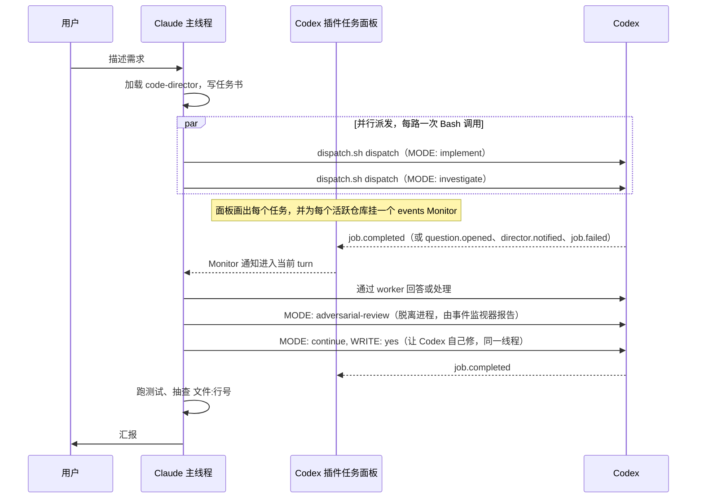

# code-director

[English](README.md) | 中文

让 Claude Code 把读代码、排查、写实现、代码 review 派给执行器 —— Codex、qodercli，或任何会说 ACP 的 agent，自己只负责跟用户对话、写任务书、判断结果。

适合的场景：你有 Claude Code 和至少一个执行器（Codex 的 ChatGPT 订阅、qodercli，或别的 ACP agent），想让 Claude 少读文件、少写代码，把上下文和输出留给判断和取舍。

## 做了什么

两个安装文件加一段配置：

| 文件 | 作用 |
|---|---|
| `skills/code-director/SKILL.md` | 给 Claude 主线程的工作规则：什么活派出去、任务书怎么写、并行怎么派、review 循环怎么跑 |
| `skills/code-director/scripts/dispatch.sh` | 全部派单逻辑：按 MODE 选执行器和命令、加上给执行器的调度者说明、通过插件的 `codex-companion.mjs` 启动、等待、收集；`dispatch` 一次调用启动一个任务，`follow` 阻塞跟随一个任务的事件流直到主会话需要出手，`events` 给监视器输出任务事件 |
| `docs/claude-md-snippet.md` | 加进 `CLAUDE.md` 的路由规则，保证相关任务每次都走这条路 |

工作流程：



## 和官方 Codex 插件的关系

依赖 Claude Code 的 Codex 插件，所有对 Codex 的调用都走它的 `codex-companion.mjs` 脚本。推荐装 [y-cruce/codex-plugin-cc](https://github.com/y-cruce/codex-plugin-cc)，它是 [openai/codex-plugin-cc](https://github.com/openai/codex-plugin-cc) 的 fork，包含 `task --thread <id>`（已提交上游 [#719](https://github.com/openai/codex-plugin-cc/pull/719)）、后台任务控制、持久事件轨迹、任务面板和多执行器支持。本仓库在这些能力之上提供分工规则和派单脚本。旧的 `codex-rescue` 和 `codex-task` 转发 agent 已不再参与这套流程。

## 安装

前置条件：

1. Claude Code（验证过 2.1.259）
2. Codex CLI 已安装并登录（验证过 0.152.1）：`npm install -g @openai/codex && codex login`
3. Claude Code 的 Codex 插件，从官方插件的 fork 安装：[y-cruce/codex-plugin-cc](https://github.com/y-cruce/codex-plugin-cc)。code-director 使用其中的 `task --thread <id>`、任务面板、Monitor 集成和实时控制。在终端执行：

   ```bash
   claude plugin uninstall codex@openai-codex   # 装过官方版才需要
   claude plugin marketplace add y-cruce/codex-plugin-cc
   claude plugin install codex@y-cruce-codex
   ```

   然后在 Claude Code 里执行 `/codex:setup` 确认状态是 ready。

安装本仓库：

```bash
git clone https://github.com/y-cruce/code-director.git
cd code-director
./install.sh
```

脚本把 skill 和 worker 脚本复制到 `~/.claude/`，并删除旧版本留下的转发 agent。然后按 `docs/claude-md-snippet.md` 把路由规则加到 `~/.claude/CLAUDE.md`，在 Claude Code 里执行 `/reload-plugins` 或重开会话。

## 使用

安装后不需要任何新命令。对 Claude 说平时的话就行：

```
这个接口偶尔返回 500，帮我查一下原因
把订单导出改成异步的，完成后发邮件通知
review 一下这个分支的改动
```

Claude 会加载 code-director，写任务书，派出去，处理任务面板报上来的事件，抽查，汇报。你也可以直接点名：「用 codex 查一下 X」。

### 任务书格式

Claude 交给 worker 脚本的内容长这样。头部几行是控制参数，空一行后是给 Codex 看的正文：

```
MODE: implement
NAME: worker 回答子命令
EFFORT: high

## Goal
...
## Context
...
## Constraints
...
## Acceptance
...
```

| MODE | 做什么 | 会不会改文件 |
|---|---|---|
| `investigate` | 读代码、追调用链、排查根因 | 不会 |
| `implement` | 按任务书写实现 | 会 |
| `continue` | 接着上一轮 Codex 的线程继续 | 头部有 `WRITE: yes` 才会 |
| `review` | 官方 review | 不会 |
| `adversarial-review` | 挑刺式 review，正文写关注点 | 不会 |

### 执行器

`EXECUTOR` 决定谁来跑 task 类模式（`investigate`、`implement`、`continue`），默认 `codex`，不写就和以前一样。

| EXECUTOR | 执行者 | 额外头部 |
|---|---|---|
| `codex`（默认） | 走插件 app-server 的 Codex | — |
| `qoder` | 走 ACP 的 qodercli；二进制按 PATH、`~/.qoder/entry/qoder`、`CODEX_DIRECTOR_QODER_COMMAND` 的顺序找 | `EXECUTOR_MODE`（Qoder 的会话模式，例如 `yolo`） |
| `acp` | 任何在 stdio 上说 Agent Client Protocol 的 agent | `EXECUTOR_COMMAND`（必填）、`EXECUTOR_ARGS`（JSON 数组）、`EXECUTOR_MODE` |

`MODEL` 指的是执行器自己的模型。Qoder 上 `dfmodel` 是默认值：快、便宜、智能程度足够自己写实现，适合大量并行。`MODEL: performance` 是 GPT-5.6-sol，1M 上下文，中间一档，接中等复杂度、`dfmodel` 扛不住的活。`MODEL: ultimate` 是 Opus 5，只留给高复杂、高难度的任务——比方案、定架构，以及把这个设计落地成代码。Qoder 默认跑在 `yolo` 权限模式，除非 `EXECUTOR_MODE` 另行指定——派出去的任务背后没人盯着，不能卡在权限确认上。

技能推荐的分工：`ultimate` 定方案，`performance` 接有份量的那几块，`dfmodel` 并行把其余实现出来，Codex 评判结果。凡是 review、挑刺、要解释根因的交给 Codex；形态已经定下来的交给 `dfmodel`。

`review` 和 `adversarial-review` 仍是 Codex 独有，配别的执行器会被拒绝。非 Codex 的 agent 没有 `request_user_input` 和 `notify_director`，任务书说明里不会提这两个工具。

必填头部：`NAME` 用几个词说明任务内容，超过 80 个字符会截断。名称显示在 dispatch/collect 输出的 `JOB:` 后；插件支持 `task --label` 时，也会显示在 status 和事件的任务 ID 旁，旧插件会输出提示并照常启动。review 命令同样传名称。

可选头部：`EFFORT`（`medium` / `high` / `xhigh`，缺省 high）、`MODEL`（缺省用你 Codex 配置里的模型）、`BASE`（review 类的基准分支）、`THREAD`（`continue` 必须续上的 Codex 线程）、`SIBLINGS`（一行写明其他正在跑的 Codex 任务，会给 Codex 看）、`CWD`（在哪个仓库里跑）。

### 线程连续性

Codex 的上下文窗口很大，一个线程会记住它读过的所有代码。同一个问题的后续追问放在同一个线程里，又快又准，所以技能按**一个问题一个 Codex 线程**来管：

- 每次 task 类结果都带回一行 `THREAD: <id>`。
- 同一个问题之后的所有派发（继续调查、追问、按调查结果实现、修 review 问题）都用 `MODE: continue`，头部带上这个 `THREAD:`。
- dispatch.sh 会核对请求的线程和插件即将续的线程是否一致，不一致就报 `THREAD_MISMATCH`，不会悄悄续到错的线程上。

插件支持 `task --thread <id>` 时（见 [openai/codex-plugin-cc#719](https://github.com/openai/codex-plugin-cc/pull/719)），dispatch.sh 精确续到指定线程，多个问题可以随意交错。旧版插件只能续当前 Claude 会话在这个仓库里最近一个跑完的 task 线程，dispatch.sh 会退回候选校验，Claude 也会避免在两次 `continue` 之间往这个仓库派其他 task 类任务。

### 看进度

Codex 在跑的时候，执行 `/codex:status` 能看到本仓库正在跑和最近完成的任务及当前阶段。`/codex:result <job-id>` 看某次的完整输出。只要视口停在底部，任务面板会跟随不断增长的轨迹；向上滚动后会停止跟随。任务结束后会在面板保留 15 分钟。

### 运行中纠偏与回答

使用支持实时控制的插件版本时，`/codex:message <job-id> <补充指令>` 会向当前轮追加消息，不必等整轮结束。加 `--queue` 则让当前轮自然跑完，消息作为同一任务、同一线程的下一轮启动；待投递位只有一个，已有一条在等时第二次 `--queue` 会被拒绝而不是替换，当前轮以失败、取消或中断结束时不投递，并在任务事件里说明。加 `--interrupt` 会取消当前轮，再由原任务在同一线程执行新指令；已有改动不会自动回滚，也不会改变原任务的写权限。返回的 Git 状态包含原有改动，不能全部归因于 Codex。

自动纠偏时运行 `bash ~/.claude/skills/code-director/scripts/dispatch.sh message <job-id> <prompt-file> --cwd <repo> [--interrupt|--queue]`：成功只输出 `MESSAGED job=<id>`；失败输出 `MESSAGE_FAILED job=<id> <reason>` 并以非零退出码结束；插件不支持时输出 `MESSAGE_UNSUPPORTED:`，退出码为 2。现在没有转发 agent，主会话的每条自动纠偏都直接走这条 worker 命令。两个参数是两种意图，不能同时给：当前 turn 必须停止时加 `--interrupt`；纠正可以等这一轮结束、由它开下一轮时加 `--queue`。两者对 Codex 和 ACP 执行器都可用；都不加则把消息并入正在跑的 Codex turn，ACP 执行器会拒绝。

同一问题的新一轮通过另一份带 `MODE: continue` 和 `THREAD:` 的任务书再次执行 `dispatch`。有结构化反问挂起时，先通过 `answer` 回答；该 request 仍然打开时，worker 会拒绝普通消息。

遇到结构化反问，主会话会收到任务面板报来的 `question.opened` 行（监视器路径下则是监视器的一条事件），底层 Codex 仍在等待。同一个 request 只会作为 `QUESTION` 上报一次，而且只在它仍然挂起时上报；已回答的 request 不再重复上报，仍未回答却再次出现的 request 改报 `QUESTION_PENDING`，提示主会话先查状态而不是重答一遍。主会话以 status 中的问题 ID 为键写入回答 JSON，例如 `{"<question-id>":{"answers":["..."]}}`，再执行 `/codex:answer <job-id> --request-id <id> --answers-file <绝对路径>`。默认等待回答 10 分钟，超时会中断并报告。

从 Bash 回答时，用 `dispatch.sh answer <job-id> <request-id> <answers-file> --cwd <repo>`。脚本发送前核对待回答请求、准确的问题 ID 和非空回答，发送后再次检查状态；成功输出 `ANSWERED job=<id> request=<id>`，失败输出 `ANSWER_FAILED` 和原因并以退出码 1 结束。`--cwd` 可放在 `answer` 后任意位置，缺省为当前目录；回答文件的相对路径按该目录解析。

**没有任何东西在等任务。** 主会话把任务书写成文件，对它跑 `dispatch.sh dispatch` 就继续做别的，这条命令几秒返回，带回任务 ID 和线程。插件的任务面板盯着本会话派出的每个任务，画出 Codex 的实时轨迹，并为每个有活跃任务的仓库自动挂一个 `events` Monitor。它的后台通知能在当前 turn 中报告完成、提问、通知、失败，以及 15 分钟无进展的 `STALLED`。仓库有 Monitor 覆盖时，面板不会再为同一个事件提交第二条提示。`/codex:tasks` 打开面板并在任务之间切换。`dispatch.sh follow <job-id>` 仍然保留，用于脚本、headless 场景，以及主会话确实想阻塞等待的时候。

宿主会在 30 分钟后结束自动 Monitor；只要还有活跃任务，面板会重新挂一个。review 派发以脱离进程方式启动，不会立即返回任务 ID，但面板会按 Claude session 扫描任务文件并显示它；Monitor 负责可靠送达带任务 ID 的终态。没有面板时（SDK、headless 或 hooks 未加载），需要在派单前自行挂 `dispatch.sh events --cwd <仓库>`。手动事件流每 2 分钟重复 `QUESTION_PENDING`，15 分钟无进展时发 `STALLED`，连续一小时没有活跃任务后以 `IDLE_EXIT` 退出。`events` 和 `follow` 收到未知参数时会列出支持项并以非零状态退出。

Codex 知道自己是被谁启动的。`investigate` 和 `implement` 两种模式下，worker 脚本会在任务书前面加一段固定说明：你是由调度代理启动的，不是人类；`request_user_input` 的提问由调度代理回答；同一工作区可能还有其他 Codex 任务在跑（名单来自主会话派单时的 `SIBLINGS:` 头），不要自行协调，有事告诉调度代理。插件支持 `notify_director` 工具时，Codex 还可以在不停下来的情况下给调度代理发一句话，以 `NOTIFIED` 事件送达，任务继续跑；写这句话时若有结构化反问挂起，该行会带上 `pending_request=<id>`，提示主会话先去回答而不是发消息。Codex 任务之间不直接对话，全部由主会话中转。

选哪条 Codex 命令、review 的兜底、给 Codex 的说明都在 `skills/code-director/scripts/dispatch.sh` 里（`dispatch` 等于 `launch` 加 `collect`），脚本本身可以用 `bash -n` 和桩 companion 测试。

`status <job-id>` 可以查看待消费消息、问题、通知和中断状态。消息被接受不代表模型已经执行；原生“下一轮排队”与这里的中途纠偏不同。本次插件修改不会自动更新已安装副本；更新插件后重开 Claude 会话，使新 broker 生效。

## 设计上的几个决定

**Codex 输出不压缩。** Claude 用 `result <job-id>` 读 Codex 的结果，一字不动。省 Claude 上下文的手段只有分工本身（Claude 不读文件、不写代码），不靠截断或摘要 Codex 的回答。

**一个问题一个线程，review 只在值得时做。** 改代码类任务先派 `implement`（改动范围不清楚时先 `investigate`，再在同一线程里 `continue` 做实现）。实现回来后由 Claude 自行判断这次改动值不值得派 `adversarial-review`，审或不审都会说明。有问题让 Codex 在同一线程里用 `continue` 自己修，最多三轮。

**并行改文件用 worktree。** 同一个 checkout 里同时只跑一路 `implement`。要让 Codex 用两种方案各写一版，给每一路建一个 `git worktree` 并写进 `CWD:`，各改各的，Claude 最后挑。

**后台启动、用事件代替等待。** task 类任务使用插件原生后台任务，`dispatch` 最多检查启动状态 10 秒，任务进入 running 且已有线程 ID，或任务已结束时提前返回。检查期间失败的任务返回 `STATUS: failed` 和一行 `ERROR:`；后续完成、结构化反问和通知经插件的任务面板回到主会话。review 以脱离进程的方式启动，由事件监视器报告。

**判断逻辑写进 shell，不靠模型自觉。** review 类任务的分支模式 / 工作区模式 / 兜底三选一，写成了固定脚本，Claude 把任务书原样交给 `dispatch.sh dispatch`，别的什么都不填。

**简单任务不委托。** Claude 三次工具调用以内、不需要理解陌生代码就能做完的事（查一个值、一次 grep、已知位置改几行、跑一条命令），直接自己做；派一次 Codex 要写任务书、还要等至少一分钟。

**文档由 Claude 自己写。** 给人看的文档和页面不派给 Codex，Codex 只负责查素材。这条只约束 Claude 的分工，不写进给 Codex 的任务书，Codex 写代码时顺手改注释或 README 不去干预。

## 已知限制

- 改了 `~/.claude/skills/` 里的技能，同一会话不会立刻生效，要 `/reload-plugins` 或重开会话。
- 官方插件的 `review` 模式不接受关注点文本，只有 `adversarial-review` 接受。
- `continue` 用于上一任务结束后的续接；运行中使用 `message` 或 `answer`，不支持实时控制的旧插件仍需等任务结束。
- 插件按「Claude 会话 + 插件安装路径」各起一个共享的 Codex 运行时，它创建过的线程都被它持有写锁。换过插件安装来源之后（比如从 `codex@openai-codex` 换到 `codex@y-cruce-codex`），要重开 Claude 会话；旧安装下创建的线程在旧运行时退出前续不上。
- 只在 macOS 上验证过。脚本用 `python3` 和标准 shell 工具，Linux 应该能用，没测。

## 许可

MIT
